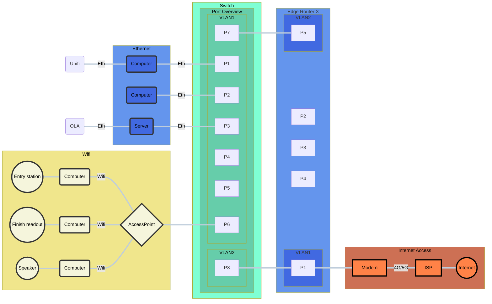

# Network overview

Example diagram for a network setup at an OL-event.

```mermaid

flowchart LR
  linkStyle default stroke:#bfcddb,stroke-width:4px,color:#000

    subgraph Internet [Internet Access]
      style Internet fill:#cd7054,color:#000
      direction TB
      M ---|4G/5G| ISP
      ISP --- Int((Internet))
      classDef Iclass fill:#ff8247,stroke:#000,stroke-width:4px,color:#000;
      class M,ISP,Int Iclass;
    end

    subgraph ER [Edge Router X]
      style ER fill:#6495ed

      subgraph VLAN21 [VLAN1]
        style VLAN21 fill:#4169e1
        PX1[P1] --- M[Modem]
      end

      subgraph VLAN22 [VLAN2]
        style VLAN22 fill:#4169e1
        PX5[P5]
      end

      PX2[P2]
      PX3[P3]
      PX4[P4]
    end

    B(Unifi) ---|Eth| C3
    O(OLA) ---|Eth| S1

    subgraph Switch
      style Switch fill:#7fffd4,color:#000
      direction TB
      P8 --- PX1
      P7 --- PX5

      subgraph Ports [Port Overview]
        style Ports fill:#66cdaa,color:#000

      subgraph VLAN1
      style VLAN1 fill:#66cdaa,color:#000
        direction TB
        P1
        P2
        P3
        P4
        P5
        P6
        P7
      end

      subgraph VLAN2
        style VLAN2 fill:#66cdaa,color:#000
        direction TB
        P8
      end
      end
    end

    subgraph Wifi
    style Wifi fill:#f0e68c,color:#000
    C1(Computer) ---|Wifi| AP
    C2(Computer) ---|Wifi| AP
    C5(Computer) ---|Wifi| AP
    AP{AccessPoint} --- P6
    E1((Entry station)):::Wclass --- C1
    F1((Finish readout)):::Wclass --- C2
    SP1((Speaker)):::Wclass --- C5
    classDef Wclass fill:#f5f5dc,stroke:#333,stroke-width:4px,color:#000;
    class C1,C2,C5,AP Wclass;
    end

    subgraph Ethernet
    style Ethernet fill:#6495ed,color:#000
    C3(Computer) ---|Eth| P1
    C4(Computer) ---|Eth| P2
    S1(Server) ---|Eth| P3
    classDef Eclass fill:#4169e1,stroke:#333,stroke-width:4px,color:#000;
    class C3,C4,S1 Eclass;
    end

```
